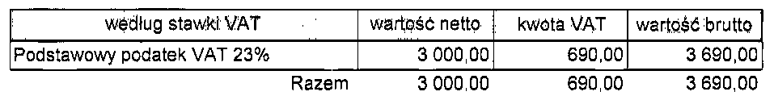

# Invoice OCR Pipeline with OpenCV & Tesseract

A robust OCR pipeline designed to accurately extract structured data from low-quality or hard-to-process invoice images.
Built for integration with LLMs for data extraction.

## Key features
- **End-to-End Pipeline**: From PDF input (easy to work with in Django) to structured text output
- **Custom Preprocessing**: Tuned specifically for real-world invoice images
- **Smart Region Detection**: OCR is performed only on meaningful segments, improving accuracy and reducing noise
- **LLM-Ready Output**: Clean, separated into chunks text - ideal for prompt-based extraction

## Main pipeline
- PDF path as input
- Get images from pages
- Preprocess image
    - Grayscale conversion
    - Adjust contrast and rightness
    - Denoise image if 30% quantile is above 240
    - Threshold image
    - Thicken Font
    - Get bounding box to reduce image size
- Deskew image
    - Classic minAreaRect method
- Get boxes from image
    - Separate image into multiple meaningfull parts, eg.
        - Invoice number
        - Invoce date
        - Table with data
        - Total amout to pay
- Use Tesseract to detect text in those boxes
- Return string with all text from boxes separated by user defined separator

## Example invoice

### After preprocessing

### Sample boxes

